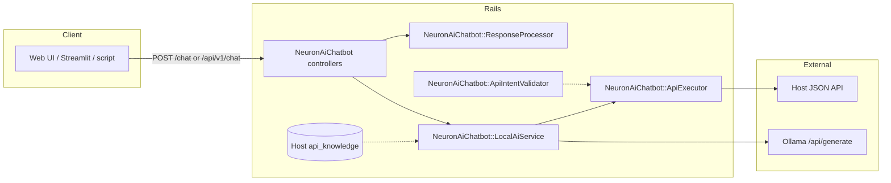
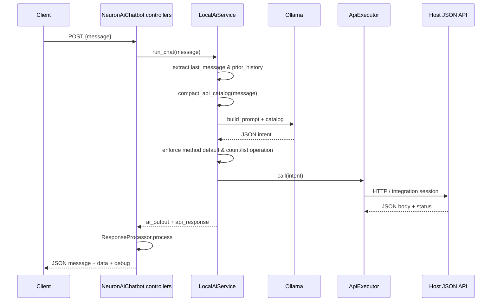

# Neuron_AI_Chatbot — installation, architecture, and operations

**Neuron_AI_Chatbot** is the Ruby gem **`neuron_ai_chatbot`** (module **`NeuronAiChatbot`**): a mountable engine that routes natural language through **Ollama** into a single JSON HTTP call against your JSON API, then normalizes the response for the web UI or API clients.

**Implementation (this gem):** `app/`, `lib/`, `config/routes.rb`.  
**Your host app:** `Gemfile`, `config/routes.rb`, initializers, and an API catalog array you assign to `NeuronAiChatbot.api_knowledge`.

**Other docs in this gem:**

- **[INSTALLATION.md](./INSTALLATION.md)** — step-by-step install & configuration (any Rails host).
- **[SETUP.md](./SETUP.md)** — short checklist.
- **[../README.md](../README.md)** — overview and links.

---

## Complete setup (step by step)

Follow these steps in order the first time you wire the engine into a Rails host.

### Step 1 — Prerequisites

- **Ruby** and **Bundler** compatible with your host app (Rails ≥ 6.1).
- **Ollama** on a host reachable from the Rails server.
- A **JSON API** (paths are usually relative to `API_EXECUTOR_BASE_URL`, e.g. `…/api/v1`).
- **API credentials** for Basic auth (or rely on in-process integration in development only).

### Step 2 — Add the gem to the host `Gemfile`

**RubyGems** (after you publish or consume a published version):

```ruby
gem "neuron_ai_chatbot", "~> 0.1"
```

**GitHub:**

```ruby
gem "neuron_ai_chatbot", github: "YOUR_ORG/neuron_ai_chatbot", branch: "main"
```

**Local path** (monorepo / development):

```ruby
gem "neuron_ai_chatbot", path: "public_gem/neuron_ai_chatbot"
```

### Step 3 — Install dependencies

```bash
bundle install
```

The gem depends on **Rails ≥ 6.1** and **HTTParty**.

### Step 4 — Define the API catalog the LLM may use

The model only sees endpoints you list. Define a frozen array of hashes (symbol keys) **before** the engine initializer runs (initializer name must load **before** `neuron_ai_chatbot.rb` if you rely on load order, e.g. `api_catalog.rb` vs `neuron_ai_chatbot.rb`).

Example constant name: `API_KNOWLEDGE` or `API_CATALOG` in `config/initializers/api_knowledge.rb`.

Each row can use keys such as `:name`, `:endpoint`, `:method`, `:description`, `:required`, `:params` / `:optional`. See [API catalog reference](#api-catalog-api_knowledge) below.

### Step 5 — Create the engine initializer

Create `config/initializers/neuron_ai_chatbot.rb` so it runs **after** the catalog constant exists:

```ruby
# frozen_string_literal: true

Rails.application.config.to_prepare do
  NeuronAiChatbot.setup do |config|
    config.api_knowledge = API_KNOWLEDGE  # or YOUR_CATALOG_CONSTANT

    # Example: host-specific param normalization (optional)
    # config.normalize_country = ->(value) { YourMapper.code_for(value) }

    # Example: extra rules appended to the Ollama prompt (optional)
    # config.additional_prompt_rules = <<~RULES
    #   - ...
    # RULES

    # Optional: full param hash transform before validation + HTTP call
    # config.param_transform = ->(params) { params }

    # Optional overrides (otherwise ENV defaults apply — see Step 7)
    # config.ollama_url = ENV.fetch("OLLAMA_URL", "http://localhost:11434/api/generate")
    # config.ollama_model = ENV.fetch("OLLAMA_MODEL", "mistral")
    # config.api_executor_base_url = ENV.fetch("API_EXECUTOR_BASE_URL", "http://localhost:3000/api/v1")
    # config.api_email = ENV["API_EMAIL"]
    # config.api_password = ENV["API_PASSWORD"]
    # config.api_executor_http_timeout = 360
    # config.max_endpoints_in_prompt = 5
    # config.integration_rails_app = Rails.application
  end
end
```

Using `to_prepare` keeps catalog and config correct in **development** after code reloads.

### Step 6 — Mount the engine in `config/routes.rb`

Inside the route scope where you want the chat:

```ruby
mount NeuronAiChatbot::Engine, at: "/"
```

That exposes:

- `GET /chat` — HTML UI  
- `POST /chat` — JSON for the UI (expects `message`, uses CSRF from the page)  
- `POST /api/v1/chat` — JSON API for scripts and tools (no CSRF; `ActionController::API`)

**Remove** duplicate routes for the same paths so only the engine owns those URLs.

**Mount prefix:** If you use `at: "/neuron"`, paths become `/neuron/chat` and `/neuron/api/v1/chat`. Update clients accordingly.

### Step 7 — Set environment variables

| Variable | Required? | Purpose |
|----------|-----------|---------|
| `OLLAMA_URL` | Optional | Default `http://localhost:11434/api/generate`. |
| `OLLAMA_MODEL` | Optional | Default `mistral`; must exist in Ollama (`ollama pull …`). |
| `API_EXECUTOR_BASE_URL` | Recommended | e.g. `http://localhost:3000/api/v1`. |
| `API_EMAIL` | Yes for real calls | Basic auth user for the JSON API. |
| `API_PASSWORD` | Yes for real calls | Basic auth password. |
| `API_EXECUTOR_HTTP_TIMEOUT` | Optional | HTTParty timeout seconds (default `360`). |

**Development:** When `Rails.env.development?` **and** `API_EXECUTOR_BASE_URL` contains `localhost`, the executor uses **in-process** `ActionDispatch::Integration::Session` against `Rails.application` (or `integration_rails_app`) instead of HTTParty.

**Dotenv:** This gem reads `OLLAMA_*` and executor settings from **`ENV` on each access** until you set them in `setup`, so `.env` values apply even if the gem loads before Dotenv.

### Step 8 — Install and run Ollama

```bash
ollama serve
ollama pull mistral   # or your OLLAMA_MODEL
```

### Step 9 — Start the Rails server

```bash
bin/rails server
```

### Step 10 — Smoke-test

**Web:** open `/chat`.

**API:**

```bash
curl -sS -u 'API_EMAIL:API_PASSWORD' \
  -H 'Content-Type: application/json' \
  -d '{"message":"User: your intent here"}' \
  http://localhost:3000/api/v1/chat
```

### Step 11 — Production

- Protect `/chat` and `/api/v1/chat` with your app’s auth or network controls.
- Store API credentials in a secret manager.
- Run Ollama on a stable, trusted network; tune timeouts.

### Step 12 — Optional

- Override engine views from the host for branding.
- Point external clients at `POST /api/v1/chat`.

---

## Architecture & operations

### 1. High-level purpose

The chatbot does **not** run arbitrary SQL or business logic in the LLM. It:

1. Uses **Ollama** to map the user’s message to **one structured “API intent”** (endpoint, HTTP method, params, operation).
2. Executes it via **`NeuronAiChatbot::ApiExecutor`** against your **JSON API** (in-process in development when the base URL is localhost; otherwise HTTParty).
3. Shapes the result via **`NeuronAiChatbot::ResponseProcessor`**.

**`NeuronAiChatbot::ApiIntentValidator`** may reject intents missing required catalog parameters (HTTP 400).

### 2. Request & response contract

#### Endpoints

| Route | Controller | Description |
|-------|------------|-------------|
| `GET /chat` | `NeuronAiChatbot::ChatController#index` | HTML UI. |
| `POST /chat` | `NeuronAiChatbot::ChatController#create` | Web JSON. |
| `POST /api/v1/chat` | `NeuronAiChatbot::Api::V1::ChatController#create` | Public API JSON. |

#### Request body

| Field | Required | Description |
|-------|----------|-------------|
| `message` | Yes | Transcript; may include `User: ...` / `AI: ...` lines. |

#### Success response (typical)

| Field | Description |
|-------|-------------|
| `success` | `true` |
| `user_input` | Echo (API route). |
| `message` | Short summary for the user. |
| `data` | Processed API payload. |
| `api_status` | HTTP status from the upstream API call. |
| `debug` | Final `ai_output` (endpoint, method, params, operation). |

### 3. Component map



### 4. End-to-end sequence



### 5. `NeuronAiChatbot::LocalAiService` details

#### 5.1 Chat history & intent separation

Transcripts split on `User: ` into **prior_history** and **last_message**. If the last message matches **next / page / more**, the **full** transcript is used for ranking and the prompt (pagination).

#### 5.2 Catalog ranking (`compact_api_catalog`)

Top **`max_endpoints_in_prompt`** rows (default **5**): token overlap scoring (prior ×1, last ×5), plus small boosts for create/POST, update/PUT, delete/DELETE.

#### 5.3 Enforcement after Ollama

- Blank **`method`** → **`GET`**.
- **count / how many** in the last user line → **`operation: count`**; else default **`list`** when absent.
- **`params`** coerced to a Hash.

Host rules: **`additional_prompt_rules`**, **`normalize_country`**, **`param_transform`** in `setup`.

#### 5.4 Ollama HTTP

**`read_timeout` 300s**; **`num_predict: 512`**, **`num_ctx: 2048`** in the request body.

### 6. Environment variables (reference)

| Variable | Typical role |
|----------|----------------|
| `OLLAMA_URL` | Inference URL. |
| `OLLAMA_MODEL` | Model tag in Ollama. |
| `API_EXECUTOR_BASE_URL` | Base including API prefix. |
| `API_EMAIL` / `API_PASSWORD` | Basic auth for outbound API calls. |
| `API_EXECUTOR_HTTP_TIMEOUT` | HTTParty timeout (seconds). |

### 7. Curated API surface (`api_knowledge`)

Assigned in **`NeuronAiChatbot.setup`**. Descriptions strongly affect routing quality.

### 8. File index

#### Inside this gem (paths relative to gem root)

| Path | Purpose |
|------|---------|
| `app/views/neuron_ai_chatbot/chat/index.html.erb` | Web UI. |
| `app/controllers/neuron_ai_chatbot/chat_controller.rb` | `GET/POST /chat`. |
| `app/controllers/neuron_ai_chatbot/api/v1/chat_controller.rb` | `POST /api/v1/chat`. |
| `app/services/neuron_ai_chatbot/local_ai_service.rb` | Ollama + catalog + prompt. |
| `app/services/neuron_ai_chatbot/api_intent_validator.rb` | Required params. |
| `app/services/neuron_ai_chatbot/api_executor.rb` | HTTP / integration session. |
| `app/services/neuron_ai_chatbot/response_processor.rb` | Response shaping. |
| `lib/neuron_ai_chatbot.rb` | Configuration module. |
| `lib/neuron_ai_chatbot/engine.rb` | `Rails::Engine`. |
| `config/routes.rb` | Engine routes. |

#### Typical host files (not shipped with the gem)

| Path | Purpose |
|------|---------|
| `config/initializers/<your_catalog>.rb` | Your `API_KNOWLEDGE` (or similar) constant. |
| `config/initializers/neuron_ai_chatbot.rb` | `NeuronAiChatbot.setup` block. |
| `config/routes.rb` | `mount NeuronAiChatbot::Engine`. |

---

## API catalog (`api_knowledge`)

| Key | Purpose |
|-----|---------|
| `:name` | Short id; ranking. |
| `:endpoint` | Path under executor base URL; use `{id}` for path ids. |
| `:method` | `GET` / `POST` / `PUT` / `PATCH` / `DELETE`. |
| `:description` | Model-facing hint. |
| `:required` | Enforced before HTTP. |
| `:params` / `:optional` | Allowed keys (hints). |

---

## Troubleshooting

| Symptom | Things to check |
|---------|-------------------|
| Ollama / parse errors | `ollama serve`, `ollama pull`, `OLLAMA_URL`. |
| `localhost` Ollama despite `.env` | Restart server; gem uses lazy ENV reads. |
| `401` / `403` | API credentials and permissions. |
| Missing required params | Catalog `:required` vs model output; `additional_prompt_rules`. |
| Wrong endpoint | Better descriptions; `max_endpoints_in_prompt`. |
| Pagination | Full `User:` / `AI:` transcript; last line **next / page / more**. |
| Unsupported HTTP method | Catalog methods vs model output. |

---

## Further reading (this gem)

- **[INSTALLATION.md](./INSTALLATION.md)** — detailed install walkthrough.
- **[SETUP.md](./SETUP.md)** — checklist.
- **[../RELEASING.md](../RELEASING.md)** — RubyGems release steps.
